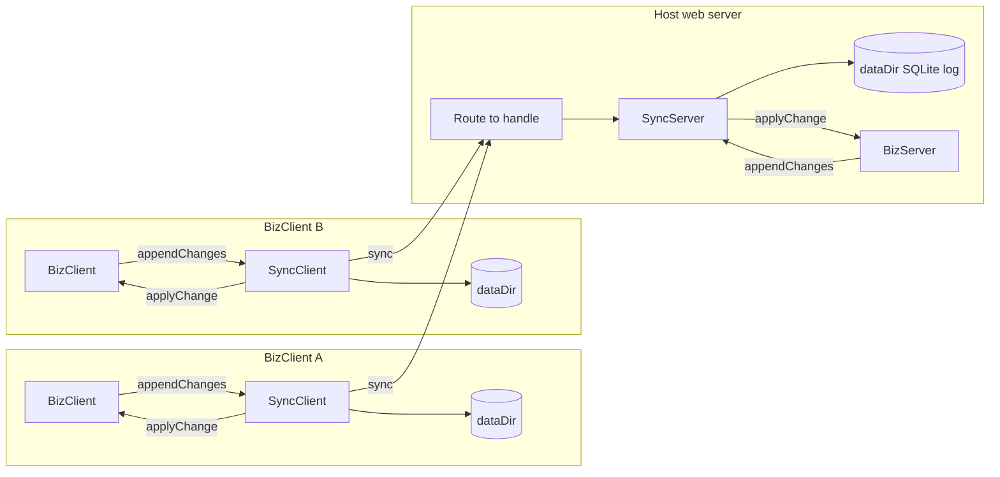

# syncbridge

Requirements: [docs/A0-syncbridge-requirements.md](./docs/A0-syncbridge-requirements.md)  
Design: [docs/A1-syncbridge-highlevel-design.md](./docs/A1-syncbridge-highlevel-design.md)

## Difficulties of a sync system

The hard part is watching the sync with a state machine. The first diagram looks small: idle, dirty, uploading, synced, failed. Each real accident adds a state and a set of arrows, and the machine becomes the thing that has to be debugged.

A timeout is not a failure. The server may have stored the edit and the phone may have missed the response. That single unknown splits `uploading` into `maybe-sent`, `sent-unacked`, and `retry`. Retry from `maybe-sent` writes the edit a second time. Staying in `sent-unacked` forever leaves the phone silent while the server already has the change.

A photo is a second object with its own life. The note can be `uploading` while the file is `pending`, `uploading`, `uploaded`, or `missing`. Those combine. `note-synced / photo-failed` and `note-failed / photo-synced` are different bugs, and both leave a record on one side that points at bytes the other side does not have.

The process dies between two arrows. The row is written and the machine is still `applying`. After restart the machine says `applying`, the row is already there, and the next pass applies it again. Or the machine is moved to `synced` and the write never landed, so the next pass skips it. The label in the machine and the bytes on disk now disagree, and every later state is built on that label.

A batch makes it worse. Ten changes in one request can be accepted through item 4. The machine has one state for the batch. Item 5 failed. There is no honest box for "4 done, 5 unknown, 6 never sent" that also survives a restart.

A second phone, a reinstall, or a clock that calls one edit newer adds more boxes: `conflict`, `their-copy-wins`, `need-full-resync`. Each box is a guess about another device. The guess is stale as soon as that device syncs again. The diagram is now the product of network result, local write, remote write, each attachment, and each item in the batch. People stop drawing it. The remaining code still switches on those states, and a path that was never drawn is the one a user hits in the field.

## Goal of this SyncBridge lightweight library

SyncBridge moves opaque change packages between clients and one server. It owns the ordered subject log, each client's pointer and retry queue, and the attachment transfer.

The business app owns the subject string, the package, and `applyChange`. That callback writes the business data and the final copy of any attachment. The host web server listens, checks the caller, and routes a request to `syncServer.handle(req, res)`.

SyncBridge reads the HTTP method and its parameters. It does not choose the endpoint path, listen on a port, poll, or open `package.data`.

## System

BizClient and BizServer are the application. SyncClient and SyncServer are the library. Two clients that pass the same subject share one server log. Each client keeps its own pointer.



## Usage tutorial

1. Install SyncBridge from git in the host project and in the client project. Both import `syncbridge/node` after that.

```sh
npm install github:juntjtang18/syncbridge
```

```json
"dependencies": {
  "syncbridge": "github:juntjtang18/syncbridge"
}
```

2. Create the server with a persistent directory. Call `init(subject, applyChange)` once for each subject. `applyChange` writes that subject's business data. The host then listens and binds `syncServer.handle(req, res)` to a path it chooses. The sample path below is `/sync`.

3. Create the client with its own persistent directory and the full endpoint URL, including that path: `createSyncClient({ dataDir, url })`. Call `init(subject, applyChange)` with the same subject string. An optional `headers` function can add the host session to each request.

4. `subject` is one opaque string. The application composes and escapes it. SyncBridge stores and compares that string and does not parse tenant or seat meaning.

```js
"default"
"tenant.company-123"
"tenant.company-123.seat.mail%40example%2Ecom"
```

5. After the app writes a local business change, call `appendChanges(package)`. This stores the change and its attachment bytes in the client retry queue. A network connection is not required.

6. A package is `{ data, attachments }`. `data` is a string or any JSON value. Each attachment at append time is `{ id, bytes, contentType, name }`. SyncBridge hashes the bytes and keeps a manifest `{ id, sha256, size, contentType, name }` in the log. It does not look inside `data` to find which attachment belongs to which field.

7. Call `sync()` when the network is available or when the user refreshes. SyncBridge does not poll. `sync()` uploads missing attachment bytes, posts the queued changes, downloads attachment bytes the client does not have, then calls `applyChange` for each server entry after the saved pointer. The pointer advances only after `applyChange` succeeds.

8. On the server, `handle` branches on the method and the parameters. The host path stays `/sync` in this example only because the host bound it there.

- `PUT /sync?sha256=ab12...` streams the body to a temp file and hashes each chunk. A matching hash and size renames the file into the attachment store. A mismatch deletes the temp file.
- `POST /sync` reads `{ subject, pointer, changes }`, appends each new change to that subject's log, stages any attachment the package names, then calls the host `applyChange(entry, attachments)`. The response is `{ acceptedIds, entries, attachmentHashes }`. The same change id is accepted once.
- `GET /sync?sha256=ab12...` streams the stored file back.

9. `attachments.get(id).read()` returns the staged bytes for that entry. Throw from `applyChange` if the business write fails. The client pointer stays put, and a failed server apply removes the new log tip so the same change id can be tried again.

10. The server stores no pointer for any client. A BizServer change that is already in business storage is appended with `appendChanges(subject, package)` and is not applied again.

## Usage example codes

Host server. The process listens. SyncBridge handles the routed request.

```js
import http from "node:http"
import { createSyncServer } from "syncbridge/node"

const syncServer = createSyncServer({ dataDir: serverDir })
syncServer.init(subject, async (entry, attachments) => {
  const photo = attachments.get("photo-1")
  const bytes = await photo.read()
  // Write entry.package.data and bytes to business storage.
  // Throw if either write fails.
})

http.createServer((req, res) => {
  const url = new URL(req.url, "http://localhost")
  if (url.pathname === "/sync") {
    syncServer.handle(req, res)
    return
  }
}).listen(port)
```

Client. `url` is the full endpoint the host bound.

```js
import { createSyncClient } from "syncbridge/node"

const client = createSyncClient({
  dataDir: clientDir,
  url: `http://127.0.0.1:${port}/sync`,
  headers() {
    return { cookie: sessionCookie }
  },
})

await client.init(subject, async (entry, attachments) => {
  const photo = attachments.get("photo-1")
  const bytes = await photo.read()
  // Write entry.package.data and bytes to local business storage.
})

await client.appendChanges({
  data: {
    poi,
    poiEntries: [
      { description: "Close-up", photo: { attachmentId: "photo-1" } },
    ],
  },
  attachments: [
    {
      id: "photo-1",
      bytes: photoBytes,
      contentType: "image/jpeg",
      name: "poi-1.jpg",
    },
  ],
})

await client.sync()
```

BizServer appends a change it has already stored. This writes the log and does not call `applyChange`.

```js
await syncServer.appendChanges(subject, {
  data: { poi: "north-wall", notes: "Measure on the next visit" },
  attachments: [],
})
```
