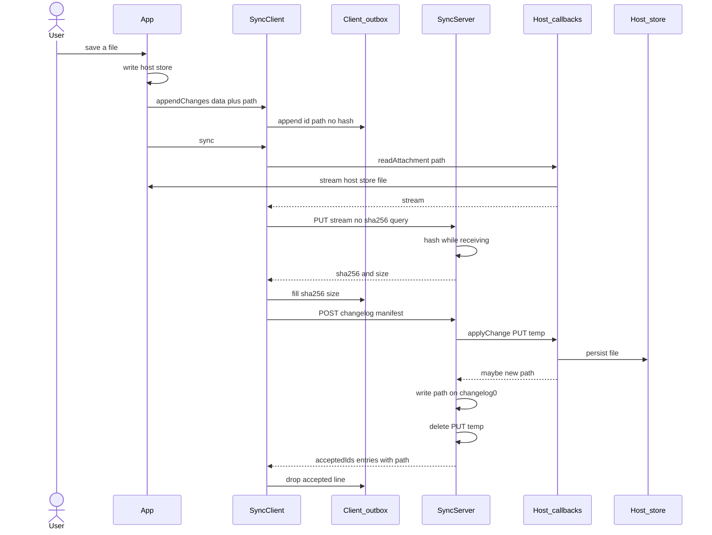
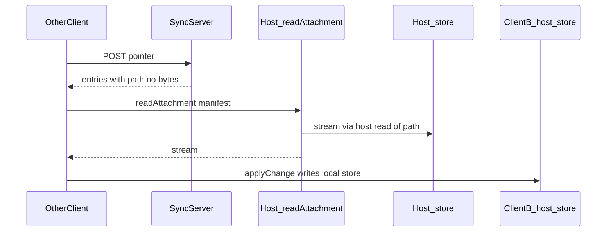

# A1-2 — Attachment pointer (no durable blob store)

**Status:** implemented · 2026-10-07  
**Amends:** [A1](./A1-syncbridge-highlevel-design.md) · **Requirements:** [A0](./A0-syncbridge-requirements.md)  
**Also:** [A1-1](./A1-1-syncbridge-changing-subject.md)

This work is **only in this repo**. Hosts (site-inspect, later apps) adopt the new callbacks after this lands. They are not part of this change.

---

# `path` as the host pointer

**Isolation.** SyncBridge knows changelog0, the fed `dataDir` (client: `current`, pointer, outbox; server: sqlite + short-lived PUT temp), and registered callbacks. It does not know iOS/Android paths, Drive, or HTTP file routes.

Rename the manifest field `name` → **`path`**. It is the host-internal pointer. Do not add `uri`. SyncBridge does not parse `path`. `GET /sync?sha256=` is only the in-flight PUT temp, so changelog0 does not need an HTTP fetch address.

`id` is the stable key inside one package (`attachments.get(id)`). `path` is where the host can read the file. `applyChange` knows where it just wrote the file and **returns** an updated `path` when that location changed. `readAttachment` is the host code that understands `path` and streams it.

Bytes move only through `readAttachment(manifest) → stream` or, on the server, the in-flight PUT temp for one `sync()`.

## 1. Why not copy on the client

Today `appendChanges` takes `bytes` and writes a second file under `dataDir/subjects/<digest>/attachments/<sha256>`. That doubles every attachment on the device.

**Do not copy.** The file already lives in the host store. `appendChanges` records `path` in the outbox. At `sync()`, SyncBridge asks the host to **stream** that file.

```js
await client.appendChanges({
  data: { /* host JSON */ },
  attachments: [{
    id: "photo-1",
    path: "grp-1-01.jpg",  // host pointer; SyncBridge does not parse it
    contentType: "image/jpeg",
  }],
})
```

No `sha256` or `size` at append. Those exist only after a full read. The host is not asked to hash at save time.

No `bytes` field. No `uri` field. No `name` field. No `attachments/` tree on the client. `dataDir` is only:

```text
<dataDir>/current
<dataDir>/subjects/<digest>/subject
<dataDir>/subjects/<digest>/pointer
<dataDir>/subjects/<digest>/outbox.jsonl    ← manifests including path
```

```js
await client.use(subject, applyChange, { readAttachment })
```

`readAttachment(manifest)` returns a stream (or async read). Same callback for **send** (`path` in the outbox) and **receive** (`path` that `applyChange` wrote onto changelog0). SyncBridge never opens the string.

**Hash during the PUT stream.** `sha256` is not known until every byte has been read. Do not buffer the file on the client to hash first, and do not require the host to hash at save. `PUT /sync` (no `?sha256=` on the way in) streams from `readAttachment`. The server already hashes while it receives (`writeHashed`). The PUT **response** is `{ sha256, size }`. The client writes those onto the outbox manifest, then POSTs. The server temp is keyed by that hash for the rest of this `sync()` only (`GET /sync?sha256=` still works in that window).

**Server** deletes the PUT temp after `applyChange` finishes. That is the only SyncBridge byte copy, and it is not durable.





## 2. Host UI — not SyncBridge

SyncBridge does not list business objects. The host owns its store. Screens read **that** store. Never walk changelog0 or `dataDir` to draw a UI.

## Implementation (this repo)

- Manifest on the log is `{ id, sha256, size, contentType, path }` — `path` replaces `name`. At `appendChanges` only `{ id, path, contentType }` is required. [src/contracts.js](../src/contracts.js): no `bytes`.
- [src/http-transport.js](../src/http-transport.js): `PUT /sync` streams without a hash query; response `{ sha256, size }`. `GET /sync?sha256=` remains for the in-flight temp only.
- [src/sync-client.js](../src/sync-client.js): outbox only; `sync()` PUT from `readAttachment`, then fill hash/size, then POST.
- [src/sync-server.js](../src/sync-server.js): hash the PUT stream; after `applyChange` returns `{ attachments: [{ id, path }] }`, patch `path` if the host moved the file, then delete PUT temp. Failed apply rolls back the tip and keeps the temp for retry.
- Do not add `uri` or `getUri`. Do not require the host to pre-hash.
- Update [docs/A0-syncbridge-requirements.md](./A0-syncbridge-requirements.md), [docs/A1-syncbridge-highlevel-design.md](./A1-syncbridge-highlevel-design.md), and [README.md](../README.md): `name` → `path`; no durable attachment store; host streams via `path`.

**Acceptance.** The whole suite is a **full regression**: `npm test` (every file under [test/](../test/)) must pass. Existing e2e and unit tests stay; update any that still send `bytes` / `name`. Host doubles for the new contract map `path` → a file the test already wrote.

**Primary e2e for this change.** A Node client and an Expo-style (fetch stream) client each `appendChanges` a file by `path`, `sync()` onto the server, and `applyChange` on the server sees the bytes. After `sync()` returns:

- the server applied the file
- client `dataDir` has no `attachments/` tree (no client staging copy)
- server `dataDir` has no leftover `blobs/`, `attachments/`, or `tmp/` files (PUT staging deleted)

Add those cases in [test/e2e.test.js](../test/e2e.test.js); keep the Expo transport coverage in [test/http.test.js](../test/http.test.js) on the same contract. A second client at pointer 0 applies the same bytes via `readAttachment`. If `applyChange` returns `{ attachments: [{ id, path }] }`, that `path` is what `readAttachment` sees.

**Host example (not this repo).** A later site-inspect change: send `path` is the local file; `applyChange` may return a D1 path; `readAttachment` streams that. No HTTP URL in changelog0.

## Out of scope

- Work in site-inspect-server or the phone app
- Peer changelog0 / client-to-client sync
- MySQL for the log
- Public or HTTP file URLs in changelog0
- A new `uri` field; keep `name` as a second field
- SyncBridge opening host paths
- Changing subject rules (see A1-1)
