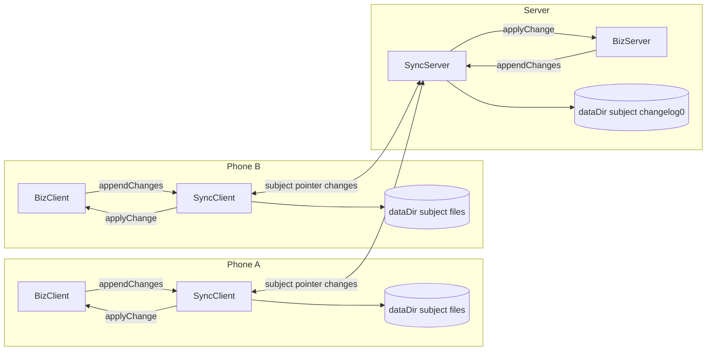

# SyncBridge — High-level design

**Status:** 2026-10-02  
**Requirements:** [A0](./A0-syncbridge-requirements.md)

SyncBridge is middleware for client-server synchronization. It moves opaque change packages. The application decides what a package means and supplies `applyChange` to write that package into its business storage.

The server owns the ordered history. A client owns only its last server position and a retry queue for its own unsent changes. SyncBridge owns both of those client files under an app-supplied `dataDir`.



Diagram 1: SyncBridge client-server synchronization

## 1. Subject

A `subject` is the name of one independent ordered log. It is one opaque string. SyncBridge does not parse or interpret it.

Nodes that use the same subject see the same log, like a publisher and subscriber that use the same queue subject. Different subjects have separate histories and separate positions.

The application can compose a readable subject from dot-separated components, escaping each component before joining:

```js
"default"
"tenant." + encode(companyId)
"tenant." + encode(tenantId) + ".seat." + encode(email)
```

For example, `tenant.company-123.seat.mail%40example%2Ecom` is one subject. The application escapes components so values such as email addresses cannot change the subject shape. SyncBridge stores and compares the final string only.

A phone can use several subjects. For example, it can synchronize one tenant-wide subject and one seat-private subject. They remain separate logs.

## 2. Change log

Each record in `changelog0` is:

```js
{ id, position, package }
```

`id` identifies a change so a retry is not appended twice. `position` is assigned by SyncServer, starts at `1`, and orders entries only inside that subject.

`package` has one generic JSON envelope:

```js
{
  data: JSONValue,
  attachments: [
    { id, sha256, size, contentType, name }
  ],
}
```

`data` can be a string, number, boolean, `null`, JSON array, or JSON object. A plain string package is therefore just:

```js
{ data: "plain text", attachments: [] }
```

`attachments` is a sibling of `data`, not part of an application's business schema. It is the generic file mechanism. Each entry is a manifest, not the file bytes. `id` is an application-selected reference, `sha256` identifies the exact byte content, `size` verifies its length, and `contentType` and `name` are optional metadata. Business data can refer to `attachments[].id`, but SyncBridge does not inspect that relationship.

SyncBridge serializes the package as JSON, but never evaluates or runs its `data`. A SQL or script string is only data to SyncBridge; it becomes dangerous only if an application's `applyChange` chooses to execute it.

The package passed to `appendChanges` has the same shape, except every attachment supplies `bytes` instead of `sha256` and `size`. SyncBridge hashes those bytes, saves them, and writes the resulting manifest into the queued package and server log.

SyncServer owns the log mechanics: assigning positions, keeping order, and returning records after a position. It does not store a pointer for any client.

## 3. Attachments

A file path alone cannot be in a package: that path exists only on the node that made the change. Putting every file byte directly into `changelog0` would duplicate large files in every replay.

SyncBridge stores attachment bytes separately, content-addressed by their SHA-256 hash:

```text
<dataDir>/<encoded-subject>/attachments/<sha256>
```

The same bytes are stored once per subject. The log stores only the attachment manifest. A sender gives file bytes to `appendChanges`; SyncBridge hashes and saves the bytes, then writes the hash into the queued package.

Attachment bytes have two server/client lifetimes:

- The server's subject attachment store is the durable source for replaying a log entry to later clients.
- A client has one immutable content-addressed blob cache per subject. Outgoing and received attachments use the same `<sha256>` file.

During `sync()`:

```text
sender         upload attachment bytes missing on server
server         verify hash and size, save attachment bytes
server         append the package manifest to changelog0
receiver       download referenced attachment bytes it does not have
receiver       verify hash and size, save bytes in blob cache
receiver       call applyChange(entry, attachments)
receiver       advance pointer
```

SyncBridge never calls `applyChange` until all attachments referenced by that entry are present and verified locally. If a hash is already in the client blob cache, it does not download another copy. New bytes are written to a temporary file, verified, then atomically moved to the hash path. It passes an attachment reader with the entry. `applyChange` moves or copies each attachment into the application's final destination. SyncBridge does not know that destination or whether it is a database, OneDrive, a local file, or another store.

The application returns success from `applyChange` only after its final business data and attachment destination are complete. Then SyncBridge advances the pointer. It retains the cache file, because it may be used by a queued outgoing package or a later received entry. A later garbage collector can remove unreferenced cache files. If attachment transfer or `applyChange` fails, the pointer stays unchanged and the next `sync()` retries the entry.

The callback contract is:

```js
async function applyChange(entry, attachments) {
  // entry = { id, position, package: { data, attachments: manifests } }

  const photo = attachments.get("photo-1")
  const bytes = await photo.read()

  // Write entry.package.data and bytes into application storage.
  // Throw if either write fails.
}
```

`attachments` is scoped to this entry. `get(id)` returns the verified attachment named by `entry.package.attachments[].id`:

```js
{
  id,
  sha256,
  size,
  contentType,
  name,
  async read(), // Promise<Uint8Array>
}
```

The contract deliberately does not expose a staging path. Node and Expo can keep different temporary-file implementations while every application reads the same attachment bytes. A later streaming reader can be added without changing attachment IDs or package schema.

For Site Inspect, `data` can be the PoI and PoI-entry descriptions; every photo becomes an attachment:

```js
{
  data: {
    poi,
    description: poiDescription,
    poiEntries: [
      { description: "Close-up", photo: { attachmentId: "photo-1" } },
    ],
  },
  attachments: [
    { id: "photo-1", bytes: photoBytes, contentType: "image/jpeg", name: "poi-1.jpg" },
  ],
}
```

## 4. Client

The platform entry creates a client once:

```js
const client = createSyncClient({ dataDir, send })
client.init(subject, applyChange)
```

`dataDir` is a persistent app directory. The Node entry uses Node file APIs; the Expo entry uses Expo file APIs. SyncBridge owns two client files per subject:

```text
<dataDir>/<encoded-subject>.pointer
<dataDir>/<encoded-subject>.queue.jsonl
```

The public client API has three calls:

```text
init(subject, applyChange)
async sync()
appendChanges(changeLog)
```

`appendChanges(changeLog)` adds a local change to the outgoing queue. It does not require a network connection.

`sync()` happens only when the app calls it; SyncBridge does not poll:

```text
sync:
  send subject, saved pointer, and queued changes
  remove each change the server accepts

  receive entries after the saved pointer
  for each entry:
    applyChange(entry)
    save entry.position as the new pointer
```

The pointer is saved only after `applyChange` succeeds. If applying an entry fails, the pointer remains unchanged and the next `sync()` receives that entry again.

## 5. Server

The server entry creates SyncServer once:

```js
const syncServer = createSyncServer({ dataDir })
syncServer.init(subject, applyChange)
```

SyncServer owns `<dataDir>/syncbridge.sqlite`. It stores `log_entries` indexed by `(subject, position)` and `(subject, id)`, so it can return entries after a pointer without scanning a text file. BizServer does not open the database or implement log storage methods.

When a client sends `{ subject, pointer, changes }`, SyncServer:

1. Opens that subject's log.
2. Appends each new client change once and assigns its position.
3. Calls the server `applyChange(entry)` for each accepted client change.
4. Returns records after `pointer`.

When BizServer calls `appendChanges(changeLog)`, SyncServer writes that change to `changelog0` but does not apply it again: BizServer already wrote its own business storage.

The transport host is responsible for authenticating callers and authorizing which subjects they may use. SyncBridge treats a subject as a log name only.

## 6. Library boundary

```text
BizClient    applyChange(entry, attachments), appendChanges
SyncClient   init, sync, appendChanges
SyncServer   init, receive, appendChanges
BizServer    applyChange(entry, attachments), appendChanges
```

SyncBridge is not built on a normal queue. The client has an outgoing retry queue, but each server subject is a durable replayable log: multiple clients can independently read entries after their own pointers.
